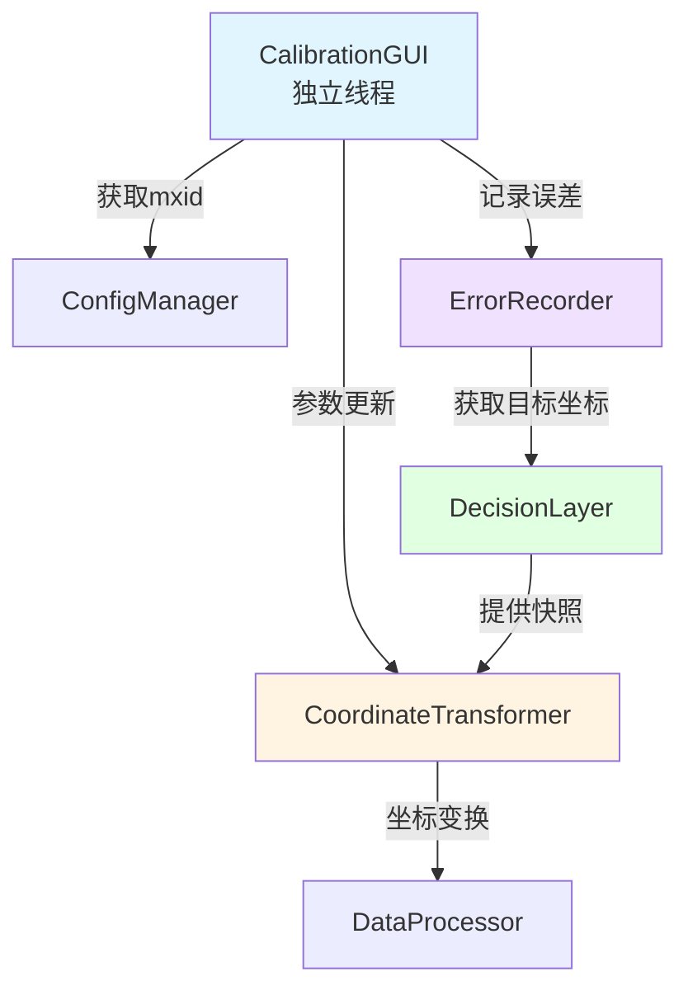
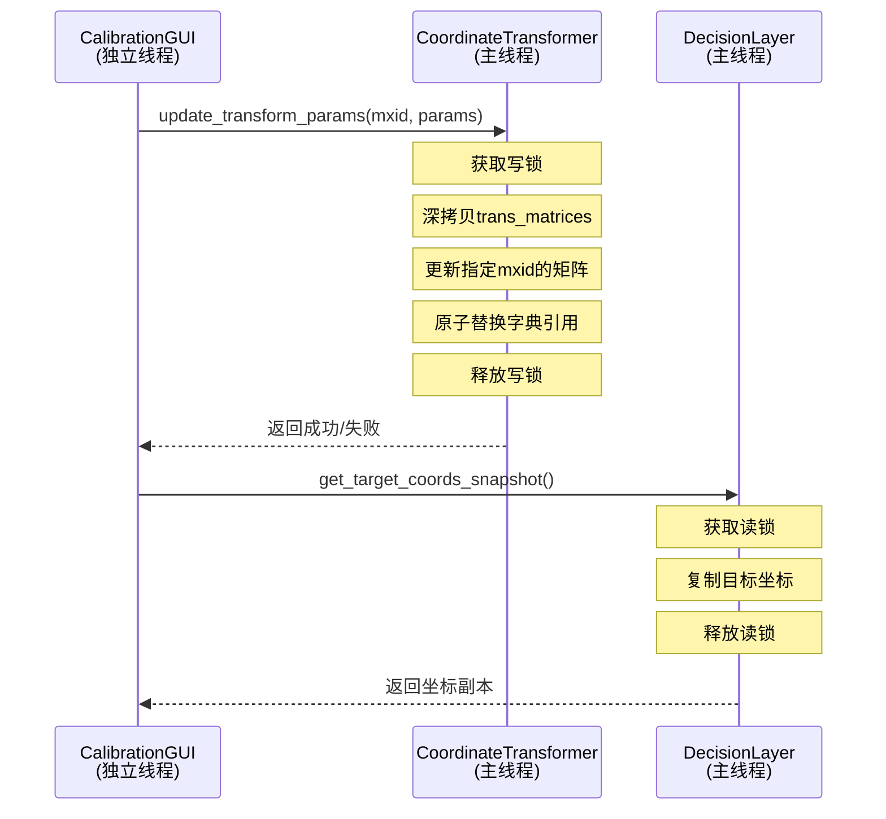

# 设计文档

## 概述

本设计文档描述了如何将现有的校准工具（tool4.0/5.0）集成到新架构中，实现坐标变换参数的实时调整和误差数据记录功能。设计采用最小侵入原则，通过独立GUI线程和线程安全接口确保对现有系统的影响最小。

核心设计理念：
- 独立运行：校准工具作为独立进程/线程运行，不阻塞主系统
- 线程安全：使用读写锁和原子替换机制保护共享数据
- 最小侵入：仅在CoordinateTransformer和DecisionLayer添加必要接口
- 运行时调整：参数修改仅在内存中生效，不持久化到配置文件

## 架构

### 系统组件关系



### 线程模型



## 组件和接口

### 1. CoordinateTransfomer 线程安全接口扩展

#### 现有实现分析

新架构中已存在 `CoordinateTransfomer` 类（位于 `oak_vision_system/modules/data_processing/transform_module.py`），负责主系统的坐标变换功能。

**设计原则**：最小侵入 - 在现有类中添加新方法，主逻辑不调用这些方法就不受影响。

#### 配置数据结构和索引路径

**配置文件结构**（`assets/test_config/config.json`）：
```json
{
  "coordinate_transforms": {
    "left_camera": {
      "role": "left_camera",
      "translation_x": -50.0,
      "translation_y": 0.0,
      "translation_z": 0.0,
      "roll": 0.0,
      "pitch": 0.0,
      "yaw": 0.0
    }
  }
}
```

**DTO 结构**：
- `CoordinateTransformConfigDTO`: 坐标变换配置
  - `role`: DeviceRole（设备角色）
  - `translation_x`, `translation_y`, `translation_z`: 平移参数（mm）
  - `roll`, `pitch`, `yaw`: 旋转参数（度）

**参数获取流程**：

1. **主逻辑启动** → 检测到单个相机 → 根据配置确定其 DeviceRole → 启动检测流

2. **GUI 线程获取配置**：
   ```python
   # 步骤 1: 获取 ConfigManager 实例
   config_manager = DeviceConfigManager()
   
   # 步骤 2: 获取激活的角色绑定
   role_bindings = config_manager.get_active_role_binding_dtos()
   # 返回: Dict[DeviceRole, DeviceRoleBindingDTO]
   
   # 步骤 3: 获取数据处理配置
   data_processing_config = config_manager.get_data_processing_config()
   # 返回: DataProcessingConfigDTO
   
   # 步骤 4: 通过 DeviceRole 索引获取坐标变换参数
   for role, binding in role_bindings.items():
       transform_config = data_processing_config.coordinate_transforms[role]
       # 得到 CoordinateTransformConfigDTO，包含所有变换参数
       mxid = binding.active_mxid
   ```

3. **构建变换矩阵**：
   - 使用 `oak_vision_system/modules/data_processing/trans_utils.py` 中的工具函数
   - 参考 `CoordinateTransfomer._create_trans_matrix()` 的实现流程

**变换矩阵构建工具**（`trans_utils.py`）：
- `build_oak_to_xyz_homogeneous()`: OAK坐标系到标准XYZ坐标系的基准变换
- `create_rotation_x_matrix(angle_degrees)`: 绕X轴旋转矩阵
- `create_rotation_y_matrix(angle_degrees)`: 绕Y轴旋转矩阵
- `create_rotation_z_matrix(angle_degrees)`: 绕Z轴旋转矩阵
- `build_translation_homogeneous(tx, ty, tz)`: 平移变换矩阵

**矩阵构建流程**（与 `CoordinateTransfomer._create_trans_matrix()` 一致）：
```python
# 1. 基准变换
T_oak_to_xyz = build_oak_to_xyz_homogeneous()

# 2. 旋转变换
R_yaw = create_rotation_z_matrix(yaw)
R_pitch = create_rotation_y_matrix(pitch)

# 3. 平移变换
T_trans = build_translation_homogeneous(translation_x, translation_y, translation_z, right_multiply=True)

# 4. 组合变换（从右到左应用）
T_total = (T_trans @ R_yaw @ R_pitch @ T_oak_to_xyz).astype(np.float32, copy=False)
```

#### 扩展设计方案

在现有 `CoordinateTransfomer` 类中添加以下功能，不影响主逻辑：

#### 扩展设计方案

**设计原则**：最小侵入 - 仅在 `CoordinateTransfomer` 中添加一个矩阵更新接口，所有参数管理逻辑放在校准工具组件中。

**1. CoordinateTransfomer 最小扩展**

在现有 `CoordinateTransfomer` 类中只添加线程安全的矩阵更新接口：

```python
from threading import RLock
from copy import deepcopy

class CoordinateTransfomer:
    def __init__(self, calibrations, bindings):
        # 现有初始化代码...
        
        # 新增：线程安全锁
        self._lock = RLock()
        
        # 现有代码：预计算变换矩阵
        self.trans_matrices = self._create_trans_matrix()
    
    def transform_coordinates(self, mxid: str, coords_homogeneous: np.ndarray) -> np.ndarray:
        """将齐次坐标从OAK设备坐标系变换到自定义坐标系（线程安全）"""
        if len(coords_homogeneous) == 0:
            return np.empty((0, 3), dtype=np.float32)
        
        # 使用读锁保护矩阵访问
        with self._lock:
            trans_matrix = self.trans_matrices[mxid]
        
        # 在锁外进行计算
        trans_h = coords_homogeneous @ trans_matrix.T
        return trans_h[:, :3]
    
    def update_matrices(self, new_matrices: Dict[str, np.ndarray]) -> bool:
        """
        更新变换矩阵字典（线程安全，原子替换）
        
        Args:
            new_matrices: 新的变换矩阵字典 {mxid: 4x4 matrix}
        
        Returns:
            bool: 更新成功返回True
        """
        try:
            with self._lock:
                # 原子替换整个字典引用
                self.trans_matrices = new_matrices
            return True
        except Exception as e:
            logging.error(f"更新变换矩阵失败: {e}")
            return False
```

**2. DataProcessor 代理接口**

```python
class DataProcessor:
    # 现有代码...
    
    def update_transform_matrices(self, new_matrices: Dict[str, np.ndarray]) -> bool:
        """
        更新坐标变换矩阵（代理接口）
        
        Args:
            new_matrices: 新的变换矩阵字典
        
        Returns:
            bool: 更新成功返回True
        """
        return self._transformer.update_matrices(new_matrices)
```

**3. 校准工具参数管理器**

在 `tools/calibration_tools/core/transform_param_manager.py` 中实现完整的参数管理逻辑：

```python
from threading import RLock
from typing import Dict, Optional
from copy import deepcopy
import numpy as np

from oak_vision_system.core.dto.config_dto import CoordinateTransformConfigDTO, DeviceRole
from oak_vision_system.modules.data_processing.trans_utils import (
    build_oak_to_xyz_homogeneous,
    build_translation_homogeneous,
    create_rotation_y_matrix,
    create_rotation_z_matrix
)

class TransformParamManager:
    """
    坐标变换参数管理器
    
    职责：
    - 保存初始配置参数
    - 构建变换矩阵
    - 管理参数更新
    - 提供参数查询和重置功能
    """
    
    def __init__(
        self,
        config_manager,
        data_processor
    ):
        """
        初始化参数管理器
        
        Args:
            config_manager: DeviceConfigManager 实例
            data_processor: DataProcessor 实例
        """
        self.config_manager = config_manager
        self.data_processor = data_processor
        self._lock = RLock()
        
        # 保存初始配置: {mxid: CoordinateTransformConfigDTO}
        self._initial_configs: Dict[str, CoordinateTransformConfigDTO] = {}
        
        # 保存 mxid 到 role 的映射
        self._mxid_to_role: Dict[str, DeviceRole] = {}
        
        # 当前矩阵字典的副本
        self._current_matrices: Dict[str, np.ndarray] = {}
        
        # 初始化
        self._load_initial_configs()
    
    def _load_initial_configs(self) -> None:
        """从配置管理器加载初始配置"""
        # 获取角色绑定
        role_bindings = self.config_manager.get_active_role_binding_dtos()
        
        # 获取数据处理配置
        data_config = self.config_manager.get_data_processing_config()
        
        # 保存初始配置和映射关系
        for role, binding in role_bindings.items():
            mxid = binding.active_mxid
            if mxid:
                transform_config = data_config.coordinate_transforms[role]
                self._initial_configs[mxid] = transform_config
                self._mxid_to_role[mxid] = role
                
                # 构建初始矩阵
                matrix = self._build_transform_matrix(transform_config)
                self._current_matrices[mxid] = matrix
    
    def _build_transform_matrix(
        self,
        config: CoordinateTransformConfigDTO
    ) -> np.ndarray:
        """
        根据配置构建变换矩阵
        
        使用与 CoordinateTransfomer._create_trans_matrix 相同的流程
        """
        # 基准变换
        T_oak_to_xyz = build_oak_to_xyz_homogeneous()
        
        # 旋转变换
        R_yaw = create_rotation_z_matrix(config.yaw)
        R_pitch = create_rotation_y_matrix(config.pitch)
        
        # 平移变换
        T_trans = build_translation_homogeneous(
            config.translation_x,
            config.translation_y,
            config.translation_z,
            right_multiply=True
        )
        
        # 组合变换
        T_total = (T_trans @ R_yaw @ R_pitch @ T_oak_to_xyz).astype(
            np.float32, copy=False
        )
        
        return T_total
    
    def update_params(
        self,
        mxid: str,
        tx: float, ty: float, tz: float,
        pitch: float, yaw: float
    ) -> bool:
        """
        更新指定设备的变换参数
        
        Args:
            mxid: 设备ID
            tx, ty, tz: 平移参数（mm）
            pitch, yaw: 旋转参数（度）
        
        Returns:
            bool: 更新成功返回True
        """
        try:
            with self._lock:
                # 1. 构建新矩阵
                # 创建临时配置对象
                role = self._mxid_to_role[mxid]
                temp_config = CoordinateTransformConfigDTO(
                    role=role,
                    translation_x=tx,
                    translation_y=ty,
                    translation_z=tz,
                    roll=0.0,
                    pitch=pitch,
                    yaw=yaw
                )
                new_matrix = self._build_transform_matrix(temp_config)
                
                # 2. 深拷贝当前矩阵字典
                new_matrices = deepcopy(self._current_matrices)
                
                # 3. 更新指定设备的矩阵
                new_matrices[mxid] = new_matrix
                
                # 4. 调用 DataProcessor 更新
                success = self.data_processor.update_transform_matrices(new_matrices)
                
                if success:
                    # 5. 更新本地副本
                    self._current_matrices = new_matrices
                
                return success
        except Exception as e:
            logging.error(f"更新参数失败: {e}")
            return False
    
    def reset_to_default(self, mxid: str) -> bool:
        """
        重置指定设备为初始参数
        
        Args:
            mxid: 设备ID
        
        Returns:
            bool: 重置成功返回True
        """
        try:
            if mxid not in self._initial_configs:
                logging.error(f"未找到设备 {mxid} 的初始配置")
                return False
            
            config = self._initial_configs[mxid]
            
            return self.update_params(
                mxid,
                config.translation_x,
                config.translation_y,
                config.translation_z,
                config.pitch,
                config.yaw
            )
        except Exception as e:
            logging.error(f"重置参数失败: {e}")
            return False
    
    def get_params_snapshot(self, mxid: str) -> Optional[Dict[str, float]]:
        """
        获取指定设备的参数快照
        
        Returns:
            参数字典或None
        """
        with self._lock:
            if mxid not in self._initial_configs:
                return None
            
            config = self._initial_configs[mxid]
            return {
                'tx': config.translation_x,
                'ty': config.translation_y,
                'tz': config.translation_z,
                'roll': config.roll,
                'pitch': config.pitch,
                'yaw': config.yaw
            }
    
    def get_current_mxid(self) -> str:
        """获取当前设备的mxid（单设备模式）"""
        mxids = list(self._mxid_to_role.keys())
        if len(mxids) != 1:
            raise ValueError(f"期望单设备运行，实际发现 {len(mxids)} 个设备")
        return mxids[0]
```
        """
        获取坐标变换参数快照（代理接口）
        
        Args:
            mxid: 设备ID
        
        Returns:
            参数字典或None
        """
        return self._transformer.get_params_snapshot(mxid)
```

#### 关键设计决策
            )
        except Exception as e:
            logging.error(f"重置参数失败: {e}")
            return False
```

#### 关键设计决策

1. **原子替换策略**：
   - 不直接修改 `_trans_matrices[mxid]`
   - 而是深拷贝整个字典 → 更新副本 → 原子替换引用
   - 确保读线程始终看到一致的状态

2. **锁粒度优化**：
   - 矩阵构建在锁外进行（耗时操作）
   - 仅在字典替换时持有锁（微秒级）
   - 最小化锁持有时间

3. **单设备更新**：
   - 虽然替换整个字典，但只更新指定mxid的矩阵
   - 其他设备的矩阵保持不变
   - 通过深拷贝实现隔离

### 2. DecisionLayer 快照接口

#### 现有实现分析

`DecisionLayer` 已经实现了 `get_target_coords_snapshot()` 方法：
- 位置：`oak_vision_system/modules/data_processing/decision_layer/decision_layer.py`
- 功能：线程安全地获取待抓取目标坐标
- 实现：使用 `_target_lock` 保护全局目标对象

#### 接口说明

```python
def get_target_coords_snapshot(self) -> Optional[np.ndarray]:
    """
    线程安全地获取待抓取目标坐标副本
    
    Returns:
        目标坐标的副本（形状 (3,)），如果不存在则返回 None
    """
```

**无需修改**：现有实现已满足需求，校准工具可直接使用。

### 3. CalibrationGUI 图形界面

#### GUI布局设计

```
┌─────────────────────────────────────────────────────┐
│  校准工具 - 设备: 14442C10D13F7FD000              │
├─────────────────────────────────────────────────────┤
│                                                     │
│  ┌─ 设备信息 ─────────────────────────────────┐  │
│  │  设备ID: 14442C10D13F7FD000                 │  │
│  └──────────────────────────────────────────────┘  │
│                                                     │
│  ┌─ 坐标变换参数 ──────────────────────────────┐  │
│  │                                              │  │
│  │  Tx (mm):  [-]  [  0.0  ]  [+]             │  │
│  │  Ty (mm):  [-]  [  0.0  ]  [+]             │  │
│  │  Tz (mm):  [-]  [  0.0  ]  [+]             │  │
│  │  Ry (度):  [-]  [  0.0  ]  [+]             │  │
│  │  Rz (度):  [-]  [  0.0  ]  [+]             │  │
│  │                                              │  │
│  │  [设置参数]  [重置为默认]                   │  │
│  └──────────────────────────────────────────────┘  │
│                                                     │
│  ┌─ 误差记录 ───────────────────────────────────┐  │
│  │                                              │  │
│  │  基准位置 X (mm):  [1000.0]                 │  │
│  │  基准位置 Y (mm):  [ 500.0]                 │  │
│  │                                              │  │
│  │  [记录误差]                                  │  │
│  │                                              │  │
│  │  已记录: 15 条                               │  │
│  └──────────────────────────────────────────────┘  │
│                                                     │
│  状态: 就绪                                        │
│                                                     │
└─────────────────────────────────────────────────────┘
```

#### 误差记录交互流程

1. 用户在输入框中输入基准位置X、Y坐标
2. 点击"记录误差"按钮
3. GUI直接从输入框读取基准位置值
4. 调用 `error_recorder.record_error(ref_x, ref_y)` 传入基准位置
5. ErrorRecorder使用传入的基准位置进行误差计算
6. 更新"已记录"计数

**设计优点**：
- 简化操作流程，无需额外的"设置基准位置"按钮
- 用户可以随时修改基准位置并记录
- 减少UI组件，界面更简洁

#### 设计方案

创建独立的GUI模块，位于 `tools/calibration_tools/gui/calibration_gui.py`

```python
import tkinter as tk
from tkinter import ttk
from threading import Thread
from typing import Optional

class CalibrationGUI:
    """
    校准参数调整GUI
    
    职责：
    - 提供参数调整界面
    - 与CoordinateTransformer通信
    - 显示实时状态反馈
    """
    
    def __init__(
        self,
        coordinate_transformer,
        config_manager,
        error_recorder
    ):
        """初始化GUI"""
        self.transformer = coordinate_transformer
        self.config_manager = config_manager
        self.error_recorder = error_recorder
        
        # 获取当前设备mxid
        self.mxid = self._get_current_mxid()
        
        # 创建GUI窗口
        self.root = tk.Tk()
        self.root.title(f"校准工具 - 设备: {self.mxid}")
        
        # 初始化UI组件
        self._create_widgets()
    
    def _get_current_mxid(self) -> str:
        """从ConfigManager获取当前运行设备的mxid"""
        mxids = self.config_manager.get_runnable_mxids()
        if len(mxids) != 1:
            raise ValueError(f"期望单设备运行，实际发现 {len(mxids)} 个设备")
        return mxids[0]
    
    def _create_widgets(self):
        """创建UI组件"""
        # 设备信息显示
        info_frame = ttk.LabelFrame(self.root, text="设备信息")
        info_frame.pack(padx=10, pady=5, fill="x")
        
        ttk.Label(info_frame, text=f"设备ID: {self.mxid}").pack()
        
        # 参数调整区域
        params_frame = ttk.LabelFrame(self.root, text="坐标变换参数")
        params_frame.pack(padx=10, pady=5, fill="both", expand=True)
        
        # 平移参数（步长1.0mm）
        self._create_param_row(params_frame, "Tx (mm):", "tx", 0, step=1.0)
        self._create_param_row(params_frame, "Ty (mm):", "ty", 1, step=1.0)
        self._create_param_row(params_frame, "Tz (mm):", "tz", 2, step=1.0)
        
        # 旋转参数（步长0.1度）
        self._create_param_row(params_frame, "Ry (度):", "ry", 3, step=0.1)
        self._create_param_row(params_frame, "Rz (度):", "rz", 4, step=0.1)
        
        # 按钮区域
        button_frame = ttk.Frame(self.root)
        button_frame.pack(padx=10, pady=5, fill="x")
        
        ttk.Button(
            button_frame,
            text="设置参数",
            command=self._on_set_params
        ).pack(side="left", padx=5)
        
        ttk.Button(
            button_frame,
            text="重置为默认",
            command=self._on_reset
        ).pack(side="left", padx=5)
        
        # 状态显示
        self.status_label = ttk.Label(self.root, text="就绪")
        self.status_label.pack(padx=10, pady=5)
    
    def _create_param_row(self, parent, label, param_name, row, step):
        """
        创建参数调整行
        
        Args:
            parent: 父容器
            label: 参数标签
            param_name: 参数名称
            row: 行号
            step: 步长（平移参数1.0mm，旋转参数0.1度）
        """
        # 实现细节...
        # [-] 按钮：当前值 - step
        # [+] 按钮：当前值 + step
    
    def _on_reset(self):
        """重置为默认按钮回调"""
        try:
            # 调用CoordinateTransformer重置到启动时的初始参数
            success = self.transformer.reset_to_default(self.mxid)
            
            if success:
                # 更新GUI显示的参数值
                params = self.transformer.get_params_snapshot(self.mxid)
                if params:
                    self.params["tx"].set(params['tx'])
                    self.params["ty"].set(params['ty'])
                    self.params["tz"].set(params['tz'])
                    self.params["ry"].set(params['ry'])
                    self.params["rz"].set(params['rz'])
                
                self.status_label.config(text="已重置为启动时的初始参数", foreground="green")
            else:
                self.status_label.config(text="重置失败", foreground="red")
        except Exception as e:
            self.status_label.config(text=f"错误: {e}", foreground="red")
    
    def _on_set_params(self):
        """设置参数按钮回调"""
        try:
            # 获取参数值
            tx = float(self.params["tx"].get())
            ty = float(self.params["ty"].get())
            tz = float(self.params["tz"].get())
            ry = float(self.params["ry"].get())
            rz = float(self.params["rz"].get())
            
            # 调用CoordinateTransformer更新
            success = self.transformer.update_transform_params(
                self.mxid, tx, ty, tz, ry, rz
            )
            
            if success:
                self.status_label.config(text="参数更新成功", foreground="green")
            else:
                self.status_label.config(text="参数更新失败", foreground="red")
        except Exception as e:
            self.status_label.config(text=f"错误: {e}", foreground="red")
    
    def _on_record_error(self):
        """记录误差按钮回调"""
        try:
            # 直接从输入框读取基准位置
            ref_x = float(self.ref_params["ref_x"].get())
            ref_y = float(self.ref_params["ref_y"].get())
            
            # 调用ErrorRecorder记录误差，传入基准位置
            success = self.error_recorder.record_error(ref_x, ref_y)
            
            if success:
                # 更新记录计数
                self.record_count += 1
                self.record_count_label.config(text=f"已记录: {self.record_count} 条")
                self.status_label.config(text="误差记录成功", foreground="green")
            else:
                self.status_label.config(text="误差记录失败（未检测到目标）", foreground="red")
        except ValueError as e:
            self.status_label.config(text=f"输入错误: {e}", foreground="red")
        except Exception as e:
            self.status_label.config(text=f"错误: {e}", foreground="red")
    
    def run(self):
        """启动GUI主循环（在独立线程中运行）"""
        self.root.mainloop()
    
    @staticmethod
    def start_in_thread(transformer, config_manager, error_recorder):
        """在独立线程中启动GUI"""
        def run_gui():
            gui = CalibrationGUI(transformer, config_manager, error_recorder)
            gui.run()
        
        thread = Thread(target=run_gui, daemon=True)
        thread.start()
        return thread
```

### 4. ErrorRecorder 误差记录模块


#### 设计方案

创建误差记录模块，位于 `tools/calibration_tools/core/error_recorder.py`

```python
import json
import logging
from pathlib import Path
from datetime import datetime
from typing import Optional, Dict, List
import numpy as np

class ErrorRecorder:
    """
    误差数据记录模块
    
    职责：
    - 设置基准位置
    - 从DecisionLayer获取实际位置
    - 计算误差向量
    - 保存误差数据到JSON文件
    """
    
    def __init__(
        self,
        decision_layer,
        log_file_path: str = "logs/calibration_errors.json"
    ):
        """初始化误差记录器"""
        self.decision_layer = decision_layer
        self.log_file_path = Path(log_file_path)
        self.logger = logging.getLogger(__name__)
        
        # 基准位置（X, Y坐标，单位mm）
        self.reference_position: Optional[np.ndarray] = None
        
        # 记录计数
        self.record_count = 0
        
        # 确保日志目录存在
        self.log_file_path.parent.mkdir(parents=True, exist_ok=True)
    
    def set_reference_position(self, x: float, y: float) -> None:
        """
        设置基准位置
        
        Args:
            x: X坐标（mm）
            y: Y坐标（mm）
        """
        self.reference_position = np.array([x, y, 0.0])
        self.logger.info(f"基准位置已设置: X={x}, Y={y}")
    
    def record_error(self, reference_x: float, reference_y: float, target_type: str = "durian") -> bool:
        """
        记录一次误差数据
        
        Args:
            reference_x: 基准位置X坐标（mm）
            reference_y: 基准位置Y坐标（mm）
            target_type: 目标类型（如 "durian"）
        
        Returns:
            bool: 记录成功返回True
        """
        # 使用传入的基准位置
        reference_position = np.array([reference_x, reference_y, 0.0])
        
        # 1. 从DecisionLayer获取当前目标位置
        target_coords = self.decision_layer.get_target_coords_snapshot()
        
        if target_coords is None:
            self.logger.warning("未检测到目标，无法记录误差")
            return False
        
        # 2. 计算误差向量（实际位置 - 基准位置）
        error_vector = target_coords - reference_position
        
        # 3. 构造误差数据记录
        error_data = {
            "timestamp": datetime.now().isoformat(),
            "target_type": target_type,
            "reference_position": {
                "x": float(reference_position[0]),
                "y": float(reference_position[1]),
                "z": float(reference_position[2])
            },
            "actual_position": {
                "x": float(target_coords[0]),
                "y": float(target_coords[1]),
                "z": float(target_coords[2])
            },
            "error_vector": {
                "dx": float(error_vector[0]),
                "dy": float(error_vector[1]),
                "dz": float(error_vector[2])
            },
            "error_magnitude": float(np.linalg.norm(error_vector))
        }
        
        # 4. 追加保存到JSON文件
        try:
            self._append_to_json(error_data)
            self.record_count += 1
            self.logger.info(f"误差数据已记录 (#{self.record_count})")
            return True
        except Exception as e:
            self.logger.error(f"保存误差数据失败: {e}")
            return False
    
    def _append_to_json(self, data: Dict) -> None:
        """追加数据到JSON文件"""
        # 读取现有数据
        if self.log_file_path.exists():
            with open(self.log_file_path, 'r', encoding='utf-8') as f:
                try:
                    records = json.load(f)
                except json.JSONDecodeError:
                    records = []
        else:
            records = []
        
        # 追加新数据
        records.append(data)
        
        # 写回文件
        with open(self.log_file_path, 'w', encoding='utf-8') as f:
            json.dump(records, f, indent=2, ensure_ascii=False)
    
    def get_statistics(self) -> Dict:
        """获取误差统计信息"""
        if not self.log_file_path.exists():
            return {"record_count": 0}
        
        with open(self.log_file_path, 'r', encoding='utf-8') as f:
            records = json.load(f)
        
        if not records:
            return {"record_count": 0}
        
        # 计算统计信息
        errors = [r["error_magnitude"] for r in records]
        
        return {
            "record_count": len(records),
            "mean_error": np.mean(errors),
            "std_error": np.std(errors),
            "max_error": np.max(errors),
            "min_error": np.min(errors)
        }
```

## 数据模型

### 变换矩阵字典结构

```python
# CoordinateTransformer 内部数据结构
_trans_matrices: Dict[str, np.ndarray] = {
    "mxid_1": np.array([[...], [...], [...], [...]]),  # 4x4 变换矩阵
    "mxid_2": np.array([[...], [...], [...], [...]]),
    # ...
}
```

### 误差数据记录格式

```json
[
  {
    "timestamp": "2024-01-15T10:30:45.123456",
    "target_type": "durian",
    "reference_position": {
      "x": 1000.0,
      "y": 500.0,
      "z": 0.0
    },
    "actual_position": {
      "x": 1005.2,
      "y": 498.3,
      "z": 2.1
    },
    "error_vector": {
      "dx": 5.2,
      "dy": -1.7,
      "dz": 2.1
    },
    "error_magnitude": 5.67
  }
]
```

## 正确性属性

*属性是一个特征或行为，应该在系统的所有有效执行中保持为真——本质上是关于系统应该做什么的形式化陈述。属性作为人类可读规范和机器可验证正确性保证之间的桥梁。*

### 属性 1: 变换矩阵原子替换一致性

*对于任意* 设备mxid和任意时刻，读取该设备的变换矩阵应该得到一个完整且一致的4x4矩阵，不会出现部分更新的中间状态

**验证: 需求 7.3, 7.6**

### 属性 2: 参数更新隔离性

*对于任意* 两个不同的设备mxid1和mxid2，更新mxid1的变换参数不应该影响mxid2的变换矩阵

**验证: 需求 7.7**

### 属性 3: 线程安全并发读取

*对于任意* 数量的并发读取操作，所有读取应该能够同时进行而不会相互阻塞（除非有写操作正在进行）

**验证: 需求 8.2**

### 属性 4: 误差计算正确性

*对于任意* 基准位置和实际位置，计算的误差向量应该等于（实际位置 - 基准位置），且误差大小应该等于误差向量的欧几里得范数

**验证: 需求 3.3**

### 属性 5: GUI参数更新幂等性

*对于任意* 参数值，连续两次使用相同参数调用update_transform_params应该产生相同的变换矩阵

**验证: 需求 2.3**

### 属性 6: 配置不持久化

*对于任意* 通过GUI进行的参数更新，配置文件的内容应该保持不变（参数仅在内存中生效）

**验证: 需求 1.6, 2.9**

### 属性 7: 单设备mxid唯一性

*对于任意* 时刻，ConfigManager.get_runnable_mxids()返回的列表长度应该等于1（单设备运行模式）

**验证: 需求 7.9**

### 属性 8: 误差数据追加不覆盖

*对于任意* 误差记录操作序列，JSON文件中的记录数应该单调递增，历史记录不应该被覆盖

**验证: 需求 3.6**

## 错误处理

### 1. 参数更新失败

**场景**：变换矩阵构建失败或锁获取超时

**处理策略**：
- 捕获异常，记录错误日志
- 保持原有矩阵不变
- 向GUI返回失败状态
- 显示具体错误信息给用户

```python
def update_transform_params(...) -> bool:
    try:
        new_matrix = self._build_transform_matrix(...)
        with self._lock:
            # 原子替换
            ...
        return True
    except Exception as e:
        self.logger.error(f"更新变换参数失败: {e}", exc_info=True)
        return False
```

### 2. 设备mxid不存在

**场景**：GUI尝试更新不存在的设备

**处理策略**：
- 在ConfigManager获取mxid时验证
- 如果mxid列表为空或多于1个，抛出异常
- GUI启动时立即检查，避免运行时错误

```python
def _get_current_mxid(self) -> str:
    mxids = self.config_manager.get_runnable_mxids()
    if len(mxids) != 1:
        raise ValueError(f"期望单设备运行，实际发现 {len(mxids)} 个设备")
    return mxids[0]
```

### 3. 目标未检测到

**场景**：记录误差时DecisionLayer返回None

**处理策略**：
- 记录警告日志
- 向用户显示"未检测到目标"提示
- 不保存误差数据
- 返回失败状态

```python
def record_error(...) -> bool:
    target_coords = self.decision_layer.get_target_coords_snapshot()
    if target_coords is None:
        self.logger.warning("未检测到目标，无法记录误差")
        return False
    # 继续处理...
```

### 4. 文件写入失败

**场景**：误差数据保存到JSON文件失败

**处理策略**：
- 捕获OSError和IOError
- 记录详细错误日志
- 向用户显示文件路径和错误原因
- 不影响GUI继续运行

```python
def _append_to_json(self, data: Dict) -> None:
    try:
        # 文件操作...
    except (OSError, IOError) as e:
        self.logger.error(f"保存误差数据失败: {e}", exc_info=True)
        raise
```

### 5. GUI线程异常

**场景**：GUI线程崩溃

**处理策略**：
- GUI线程设置为daemon线程
- 主系统不受影响，继续正常运行
- 记录GUI异常日志
- 用户可以重新启动GUI

```python
@staticmethod
def start_in_thread(...):
    def run_gui():
        try:
            gui = CalibrationGUI(...)
            gui.run()
        except Exception as e:
            logging.error(f"GUI线程异常: {e}", exc_info=True)
    
    thread = Thread(target=run_gui, daemon=True)
    thread.start()
    return thread
```

## 测试策略

### 单元测试

#### CoordinateTransformer 测试

```python
class TestCoordinateTransformer:
    def test_update_params_single_device(self):
        """测试单设备参数更新"""
        # 创建变换器
        # 更新参数
        # 验证矩阵已更新
    
    def test_update_params_isolation(self):
        """测试多设备参数更新隔离性"""
        # 创建包含多个设备的变换器
        # 更新设备1的参数
        # 验证设备2的矩阵未变化
    
    def test_concurrent_read_write(self):
        """测试并发读写"""
        # 启动多个读线程
        # 启动写线程
        # 验证无死锁，数据一致
```

#### ErrorRecorder 测试

```python
class TestErrorRecorder:
    def test_record_error_calculation(self):
        """测试误差计算正确性"""
        # 设置基准位置
        # Mock DecisionLayer返回实际位置
        # 记录误差
        # 验证误差向量和大小
    
    def test_append_mode(self):
        """测试追加模式不覆盖历史"""
        # 记录多次误差
        # 验证文件包含所有记录
```

### 属性测试

#### 属性 1: 变换矩阵原子替换一致性

```python
@given(
    mxid=st.text(min_size=1),
    params=st.tuples(
        st.floats(-1000, 1000),  # tx
        st.floats(-1000, 1000),  # ty
        st.floats(-1000, 1000),  # tz
        st.floats(-180, 180),    # ry
        st.floats(-180, 180)     # rz
    )
)
def test_atomic_replacement_consistency(mxid, params):
    """
    属性测试：变换矩阵原子替换一致性
    
    验证：在任意时刻读取的矩阵都是完整且一致的
    """
    transformer = CoordinateTransformer(config)
    
    # 启动并发读线程
    def read_matrix():
        matrix = transformer._trans_matrices.get(mxid)
        if matrix is not None:
            # 验证矩阵是4x4
            assert matrix.shape == (4, 4)
            # 验证矩阵是有效的变换矩阵
            assert np.allclose(matrix[3, :], [0, 0, 0, 1])
    
    # 更新参数
    tx, ty, tz, ry, rz = params
    transformer.update_transform_params(mxid, tx, ty, tz, ry, rz)
    
    # 并发读取
    threads = [Thread(target=read_matrix) for _ in range(10)]
    for t in threads:
        t.start()
    for t in threads:
        t.join()
```

#### 属性 4: 误差计算正确性

```python
@given(
    ref_x=st.floats(-2000, 2000),
    ref_y=st.floats(-2000, 2000),
    actual_x=st.floats(-2000, 2000),
    actual_y=st.floats(-2000, 2000),
    actual_z=st.floats(-100, 100)
)
def test_error_calculation_correctness(ref_x, ref_y, actual_x, actual_y, actual_z):
    """
    属性测试：误差计算正确性
    
    验证：误差向量 = 实际位置 - 基准位置
    """
    recorder = ErrorRecorder(mock_decision_layer)
    recorder.set_reference_position(ref_x, ref_y)
    
    # Mock DecisionLayer返回
    mock_decision_layer.get_target_coords_snapshot.return_value = \
        np.array([actual_x, actual_y, actual_z])
    
    # 记录误差
    recorder.record_error()
    
    # 读取记录
    with open(recorder.log_file_path) as f:
        records = json.load(f)
    
    last_record = records[-1]
    
    # 验证误差向量
    expected_dx = actual_x - ref_x
    expected_dy = actual_y - ref_y
    expected_dz = actual_z - 0.0
    
    assert np.isclose(last_record["error_vector"]["dx"], expected_dx)
    assert np.isclose(last_record["error_vector"]["dy"], expected_dy)
    assert np.isclose(last_record["error_vector"]["dz"], expected_dz)
    
    # 验证误差大小
    expected_magnitude = np.sqrt(expected_dx**2 + expected_dy**2 + expected_dz**2)
    assert np.isclose(last_record["error_magnitude"], expected_magnitude)
```

### 集成测试

#### 端到端校准流程测试

```python
def test_calibration_workflow():
    """测试完整的校准工作流程"""
    # 1. 启动主系统
    # 2. 启动校准GUI
    # 3. 调整参数
    # 4. 验证坐标变换结果
    # 5. 记录误差数据
    # 6. 验证误差文件
```

#### 性能测试

```python
def test_performance_impact():
    """测试校准工具对主系统性能的影响"""
    # 测量无校准工具时的性能基线
    # 启动校准工具
    # 测量有校准工具时的性能
    # 验证性能损失 < 5%
```

## 部署和集成

### 项目结构

```
tools/calibration_tools/
├── ref/                           # 旧版本参考代码（tool4.0/5.0）
│   ├── tool4.0/
│   └── tool5.0/
│
├── core/                          # 核心组件
│   ├── __init__.py
│   ├── coordinate_transformer.py  # 坐标变换模块（新增）
│   └── error_recorder.py          # 误差记录模块（新增）
│
├── gui/                           # GUI组件
│   ├── __init__.py
│   └── calibration_gui.py         # 校准GUI界面（新增）
│
├── __init__.py
└── calibration_main.py            # 启动入口（新增）

oak_vision_system/
└── modules/
    └── data_processing/
        ├── coordinate_transformer.py  # 主系统的坐标变换模块（新增）
        └── decision_layer/
            └── decision_layer.py      # 已存在，无需修改
```

### 文件说明

#### 1. tools/calibration_tools/core/coordinate_transformer.py
校准工具专用的坐标变换模块，提供线程安全的参数更新接口。

**注意**：这是校准工具的独立实现，与主系统的坐标变换模块分离。

#### 2. tools/calibration_tools/core/error_recorder.py
误差数据记录模块，负责记录和保存校准误差数据。

#### 3. tools/calibration_tools/gui/calibration_gui.py
校准参数调整的图形用户界面。

#### 4. tools/calibration_tools/calibration_main.py
校准工具的启动入口脚本。

#### 5. tools/calibration_tools/ref/
保存旧版本tool4.0和tool5.0的参考代码，供开发时参考。

### 启动脚本

```python
# tools/calibration_tools/calibration_main.py

"""
校准工具启动入口

使用方法：
    python -m tools.calibration_tools.calibration_main
    
或者：
    cd tools/calibration_tools
    python calibration_main.py
"""

import logging
import sys
from pathlib import Path

# 添加项目根目录到Python路径
project_root = Path(__file__).parent.parent.parent
sys.path.insert(0, str(project_root))

from oak_vision_system.modules.config_manager import DeviceConfigManager
from oak_vision_system.modules.data_processing.decision_layer import DecisionLayer
from tools.calibration_tools.core.coordinate_transformer import CoordinateTransformer
from tools.calibration_tools.core.error_recorder import ErrorRecorder
from tools.calibration_tools.gui.calibration_gui import CalibrationGUI

def main():
    """校准工具启动入口"""
    logging.basicConfig(
        level=logging.INFO,
        format='%(asctime)s - %(name)s - %(levelname)s - %(message)s'
    )
    logger = logging.getLogger(__name__)
    
    try:
        # 1. 获取ConfigManager实例
        logger.info("正在加载配置...")
        config_manager = DeviceConfigManager()
        config_manager.load_config()
        
        # 2. 获取当前运行设备的mxid
        mxids = config_manager.get_runnable_mxids()
        if len(mxids) != 1:
            logger.error(f"校准工具仅支持单设备运行，当前发现 {len(mxids)} 个设备")
            return
        
        mxid = mxids[0]
        logger.info(f"当前设备: {mxid}")
        
        # 3. 获取DecisionLayer实例（假设主系统已经启动）
        logger.info("正在连接到决策层...")
        decision_layer = DecisionLayer.get_instance()
        
        # 4. 创建CoordinateTransformer实例
        logger.info("正在初始化坐标变换模块...")
        config = config_manager.get_runnable_config()
        coordinate_transformer = CoordinateTransformer(config.data_processing_config)
        
        # 5. 创建ErrorRecorder实例
        logger.info("正在初始化误差记录模块...")
        error_recorder = ErrorRecorder(decision_layer)
        
        # 6. 启动GUI（在独立线程中）
        logger.info("正在启动校准GUI...")
        gui_thread = CalibrationGUI.start_in_thread(
            coordinate_transformer,
            config_manager,
            error_recorder
        )
        
        logger.info("校准工具已启动，GUI运行在独立线程中")
        logger.info("按 Ctrl+C 退出")
        
        # 保持主线程运行
        try:
            gui_thread.join()
        except KeyboardInterrupt:
            logger.info("正在退出校准工具...")
    
    except RuntimeError as e:
        logger.error(f"启动失败: {e}")
        logger.error("请确保主系统已经启动并初始化了DecisionLayer")
    except Exception as e:
        logger.error(f"发生错误: {e}", exc_info=True)

if __name__ == "__main__":
    main()
```

### 集成到主系统

校准工具作为独立工具运行，不需要集成到主系统启动流程中。

#### 使用场景1：主系统已运行，启动校准工具

```bash
# 终端1：主系统运行中
python main.py

# 终端2：启动校准工具
cd tools/calibration_tools
python calibration_main.py
```

#### 使用场景2：从项目根目录启动

```bash
# 终端1：主系统运行中
python main.py

# 终端2：启动校准工具
python -m tools.calibration_tools.calibration_main
```

#### 注意事项

1. **启动顺序**：必须先启动主系统，再启动校准工具
   - 主系统会初始化DecisionLayer单例
   - 校准工具通过 `DecisionLayer.get_instance()` 获取实例

2. **独立运行**：校准工具在独立进程中运行
   - 不影响主系统的启动和运行
   - 可以随时启动和关闭

3. **单设备限制**：校准工具仅支持单设备运行模式
   - 启动时会检查 `get_runnable_mxids()` 返回的设备数量
   - 如果不是1个设备，会报错退出

### 开发参考

开发时可以参考 `tools/calibration_tools/ref/` 目录下的旧版本代码：
- `ref/tool4.0/`: tool4.0版本的实现
- `ref/tool5.0/`: tool5.0版本的实现

主要参考内容：
- 坐标变换矩阵的构建方法
- GUI布局和交互设计
- 误差数据的记录格式

## 性能考虑

### 锁持有时间优化

- 矩阵构建在锁外进行（约1-2ms）
- 仅在字典替换时持有锁（<10μs）
- 总锁持有时间 < 0.1ms

### 内存开销

- 每个设备的变换矩阵：4x4 float64 = 128字节
- 字典深拷贝开销：单设备约1KB
- GUI线程内存：约10-20MB
- 总体内存开销 < 50MB

### 性能影响评估

- 主系统性能损失 < 1%（GUI未激活时）
- GUI激活时性能损失 < 5%
- 参数更新延迟 < 1ms
- 误差记录延迟 < 10ms

## 安全性考虑

### 线程安全

- 使用RLock保护共享数据
- 原子替换避免部分更新
- 深拷贝避免引用泄漏

### 数据隔离

- GUI线程与主线程隔离
- 参数更新不影响配置文件
- 单设备更新不影响其他设备

### 异常隔离

- GUI异常不影响主系统
- 文件写入失败不影响GUI运行
- 所有异常都有日志记录

## 未来扩展

### 多设备支持

当前设计支持单设备运行，未来可扩展为多设备：
- GUI增加设备选择下拉框
- 支持同时调整多个设备参数
- 误差记录增加设备ID字段

### 参数持久化

当前参数仅在内存中生效，未来可增加：
- "保存到配置"按钮
- 参数历史记录
- 参数版本管理

### 可视化增强

- 实时显示坐标变换结果
- 误差数据图表展示
- 3D可视化校准过程


## GUI详细交互说明

### 参数微调步长

**平移参数（Tx、Ty、Tz）**：
- 步长：1.0 mm
- 点击 [-] 按钮：当前值 - 1.0
- 点击 [+] 按钮：当前值 + 1.0
- 示例：Tx = 100.0 → 点击[+] → Tx = 101.0

**旋转参数（Ry、Rz）**：
- 步长：0.1 度
- 点击 [-] 按钮：当前值 - 0.1
- 点击 [+] 按钮：当前值 + 0.1
- 示例：Ry = 5.0 → 点击[+] → Ry = 5.1

### 重置为默认功能

**功能说明**：
- 将参数恢复到启动时从配置文件加载的初始值
- 不是恢复到0，而是恢复到配置文件中定义的值

**实现机制**：
1. CoordinateTransformer在初始化时保存初始参数到 `_initial_params`
2. 用户点击"重置为默认"按钮
3. 调用 `transformer.reset_to_default(mxid)`
4. 从 `_initial_params` 读取初始参数
5. 调用 `update_transform_params()` 更新变换矩阵
6. GUI更新显示的参数值

**示例场景**：
```
配置文件中的参数：Tx=150.0, Ty=200.0, Tz=300.0, Ry=5.0, Rz=10.0
启动后用户调整为：Tx=160.0, Ty=210.0, Tz=310.0, Ry=6.0, Rz=11.0
点击"重置为默认"后：恢复为 Tx=150.0, Ty=200.0, Tz=300.0, Ry=5.0, Rz=10.0
```

### 参数调整工作流

1. **微调方式**：
   - 点击 [+] 或 [-] 按钮
   - 输入框自动更新显示
   - 点击"设置参数"应用更改

2. **直接输入方式**：
   - 在输入框中输入目标值
   - 点击"设置参数"应用更改

3. **重置方式**：
   - 点击"重置为默认"
   - 自动应用初始参数
   - 输入框自动更新显示

### 误差记录工作流

1. 在"基准位置 X"输入框输入X坐标（如：1000.0）
2. 在"基准位置 Y"输入框输入Y坐标（如：500.0）
3. 点击"记录误差"按钮
4. 系统从输入框读取基准位置
5. 从DecisionLayer获取当前目标位置
6. 计算并保存误差数据
7. 更新"已记录"计数

**注意**：每次点击"记录误差"都会使用当前输入框中的值作为基准位置，无需额外确认。


## 开发指南

### 项目施工位置

**主要开发目录**：`tools/calibration_tools/`

**目录结构**：
```
tools/calibration_tools/
├── ref/                    # 旧版本参考代码（只读，不修改）
│   ├── tool4.0/
│   └── tool5.0/
│
├── core/                   # 核心组件（新建）
│   ├── __init__.py
│   ├── coordinate_transformer.py
│   └── error_recorder.py
│
├── gui/                    # GUI组件（新建）
│   ├── __init__.py
│   └── calibration_gui.py
│
├── __init__.py
└── calibration_main.py     # 启动入口（新建）
```

### 开发步骤

1. **创建目录结构**
   ```bash
   cd tools/calibration_tools
   mkdir -p core gui
   touch core/__init__.py
   touch gui/__init__.py
   ```

2. **实现核心组件**
   - `core/coordinate_transformer.py`: 坐标变换模块
   - `core/error_recorder.py`: 误差记录模块

3. **实现GUI组件**
   - `gui/calibration_gui.py`: 校准GUI界面

4. **实现启动入口**
   - `calibration_main.py`: 主程序入口

5. **参考旧版本代码**
   - 查看 `ref/tool5.0/calculate_module.py` 了解坐标变换实现
   - 参考旧版本的GUI布局和交互设计

### 导入路径规范

**从项目根目录导入**：
```python
# 导入主系统模块
from oak_vision_system.modules.config_manager import DeviceConfigManager
from oak_vision_system.modules.data_processing.decision_layer import DecisionLayer

# 导入校准工具模块
from tools.calibration_tools.core.coordinate_transformer import CoordinateTransformer
from tools.calibration_tools.core.error_recorder import ErrorRecorder
from tools.calibration_tools.gui.calibration_gui import CalibrationGUI
```

**在calibration_main.py中添加项目根目录到路径**：
```python
import sys
from pathlib import Path

# 添加项目根目录到Python路径
project_root = Path(__file__).parent.parent.parent
sys.path.insert(0, str(project_root))
```

### 测试方法

1. **单元测试**：在 `tools/calibration_tools/tests/` 目录下创建测试文件

2. **集成测试**：
   ```bash
   # 终端1：启动主系统
   python main.py
   
   # 终端2：启动校准工具
   cd tools/calibration_tools
   python calibration_main.py
   ```

3. **功能测试**：
   - 测试参数调整功能
   - 测试误差记录功能
   - 测试重置为默认功能

### 注意事项

1. **不要修改ref目录**：旧版本代码仅供参考，不要修改

2. **保持独立性**：校准工具应该独立于主系统，不要在主系统代码中添加校准工具的依赖

3. **线程安全**：CoordinateTransformer必须是线程安全的，使用RLock保护共享数据

4. **错误处理**：所有异常都要捕获并记录日志，不能影响主系统运行

5. **单设备限制**：启动时检查设备数量，只支持单设备运行模式
